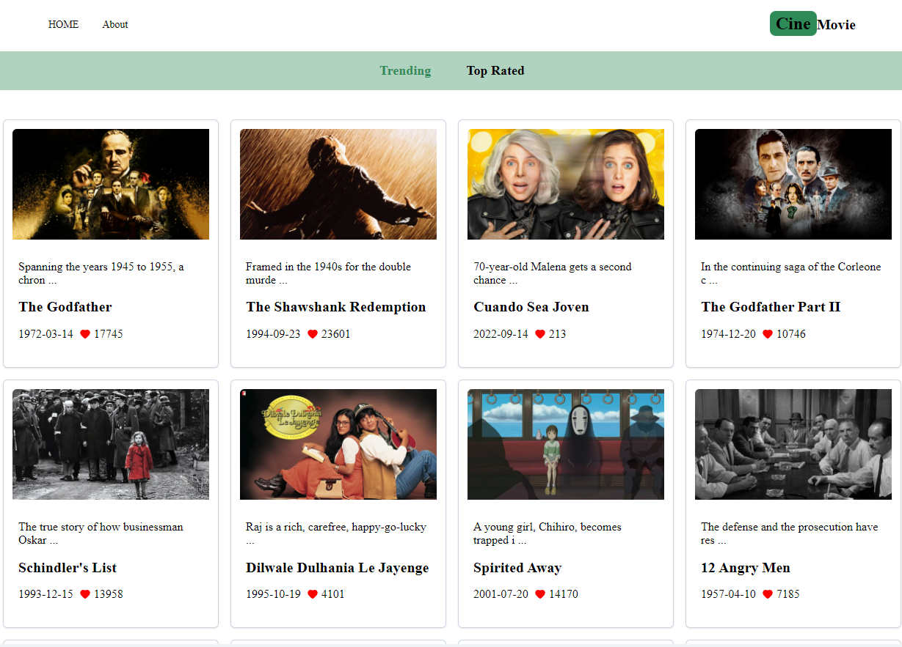
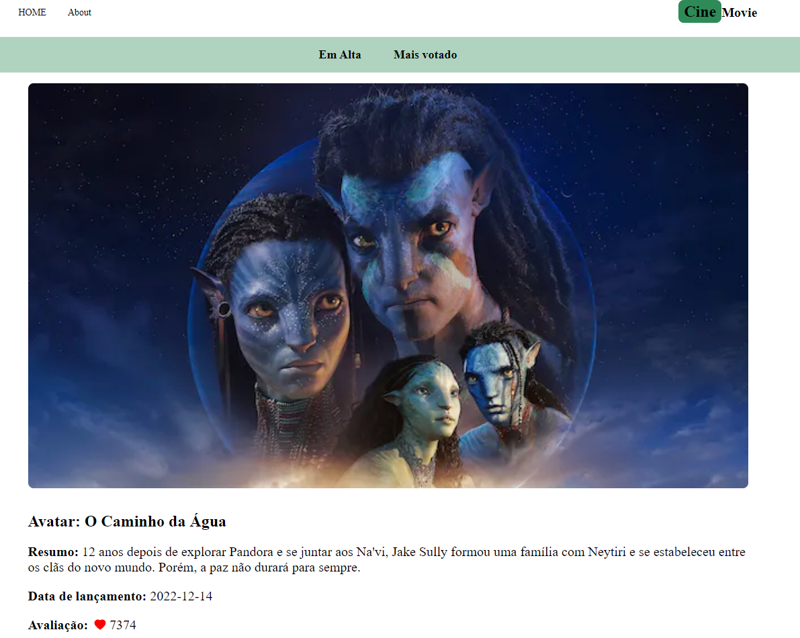
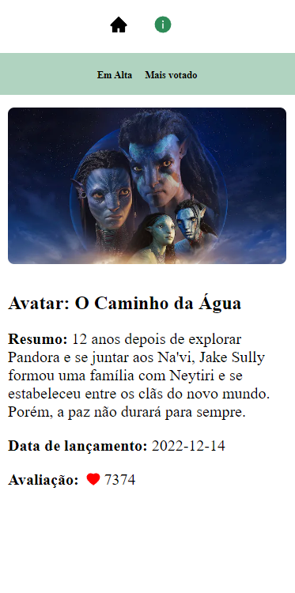
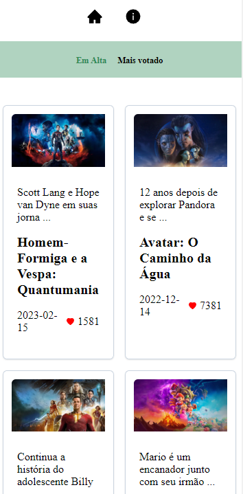

# CineMovie
Project with React, consuming the TMDB API using fetch.

### Demo

[cine-movie-rho.vercel.app](cine-movie-rho.vercel.app)

### Running it locally

`npm run dev`

### Core technologies

- Next.js
- Styled Components
- React Icons

### Layout

### Mobile

